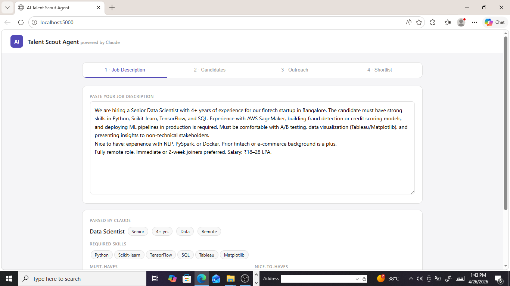
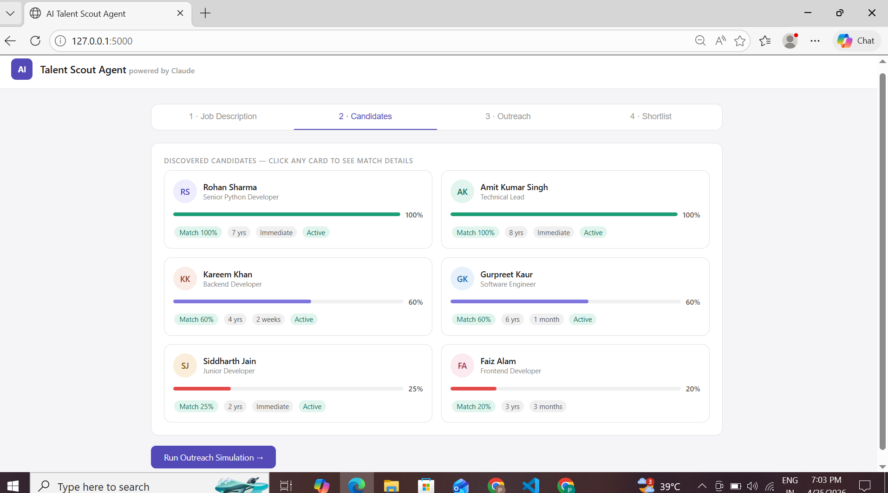
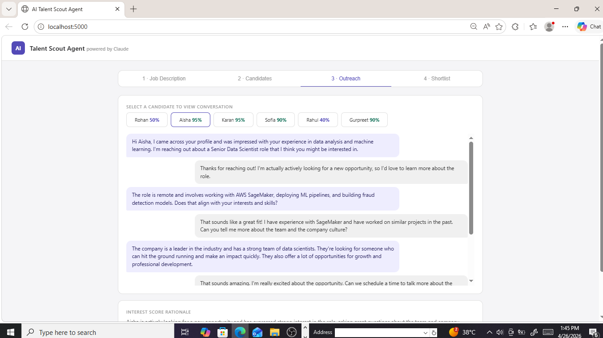
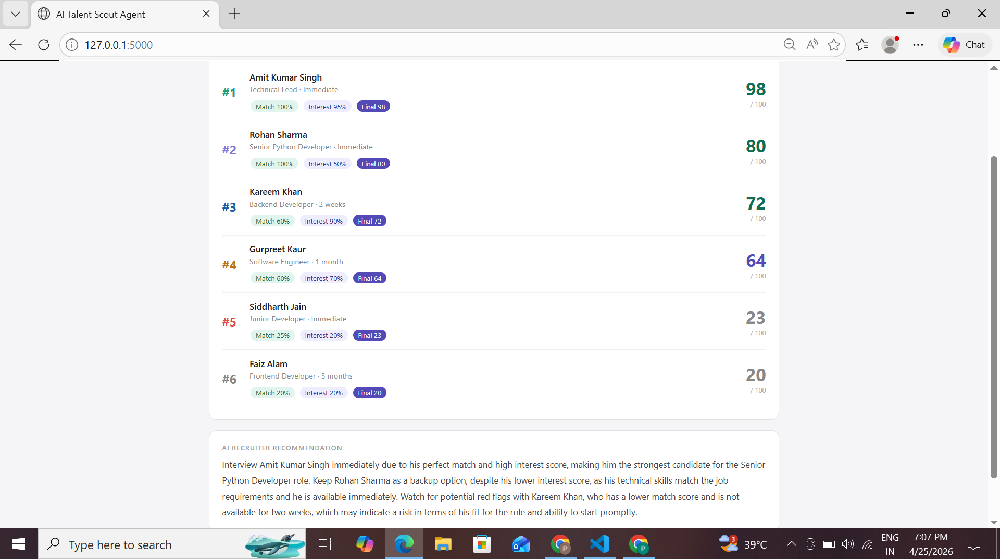
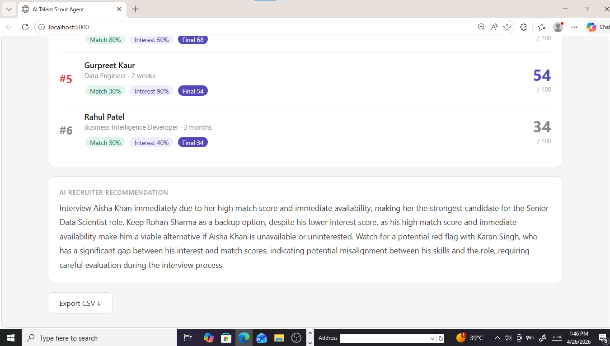

# 🤖 AI Talent Scout Agent

An intelligent recruitment automation tool that simulates the full hiring pipeline — from parsing a job description to generating a ranked candidate shortlist — powered by **Groq's free LLaMA API**.

---

## 🎥 Demo Video

> [Click here to watch the 4-minute walkthrough](https://youtu.be/3YtNG2TbLSw)

## 🚀 Live Demo
> [Click here to see live demo](https://ai-talent-scout-awh8.onrender.com)

## 🚀 What It Does

1. **Parse JD** — Paste any job description and AI extracts role, skills, must-haves, and nice-to-haves
2. **Discover Candidates** — AI generates 6 realistic candidate profiles and scores each against the JD
3. **Outreach Simulation** — Simulates LinkedIn-style conversations to gauge candidate interest
4. **Ranked Shortlist** — Combines match score + interest score into a final ranking with an AI recruiter recommendation

---

## 🏗️ Architecture

```
User (Browser)
     │
     ▼
index.html  ──────────────────────────────────────────┐
(Vanilla JS)                                          │
     │  fetch() POST requests                         │
     ▼                                                │
Flask Backend (app.py)                                │
     │                                                │
     ├── /parse_jd           → Groq LLaMA API ────────┤
     ├── /discover_candidates → Groq LLaMA API ────────┤
     ├── /run_outreach        → Groq LLaMA API ────────┤
     └── /build_shortlist     → Python (formula) + Groq─┘
```

**How it flows:**
- The frontend is a single HTML page that sends data step by step to Flask
- Flask sends structured prompts to Groq's LLaMA 3.3 70B model
- All AI responses come back as JSON, parsed and displayed in the UI
- No database — all state lives in the browser between steps

---

## 📊 Scoring Logic

### Match Score (0–100)
AI compares the candidate's skills, experience, and background against the JD requirements. Scored per candidate by the LLM with an explicit rationale.

### Interest Score (0–100)
Derived from a simulated outreach conversation. Higher scores reflect candidates who are actively looking, ask good questions, and respond enthusiastically.

| Interest Level | Score Range |
|----------------|-------------|
| Very excited, actively looking | 80–100 |
| Interested but has concerns | 60–79 |
| Lukewarm, not actively searching | 40–59 |
| Politely uninterested | 0–39 |

### Final Score Formula
```
Final Score = (Match Score × 0.6) + (Interest Score × 0.4)
```
Skills fit is weighted more (60%) because skills gaps are slow to fix. Interest still counts (40%) because a disengaged candidate wastes everyone's time.

---

## 📸 Sample Input & Output

### 📥 Input — Job Description


### 📤 Output — Matched Candidates


### 📤 Output — Outreach Conversations


### 📤 Output — Final Ranked Shortlist


### 📤 Output — AI summary


---

## 🛠️ Tech Stack

- **Backend** — Python, Flask
- **AI** — Groq API (LLaMA 3.3 70B) — completely free
- **Frontend** — Vanilla HTML, CSS, JavaScript (single page)

---

---

## Run locally with clear setup instruction below

## ⚙️ Local Setup

### 1. Clone the repo
```bash
git clone https://github.com/Pooja389/ai-talent-scout.git
cd ai-talent-scout
```
### 2. Create and activate virtual environment
```bash
python -m venv venv
venv\Scripts\activate
```
### 3. Install dependencies
```bash
pip install -r requirements.txt
```

### 4. Get your free Groq API key
Go to [https://console.groq.com](https://console.groq.com) → API Keys → Create key (no credit card needed)

### 5. Create a `.env` file
```
GROQ_API_KEY=your_key_here
```

### 6. Run the app
```bash
python app.py
```

### 7. Open in browser
```
http://localhost:5000
```

---

## 📁 Project Structure

```
ai-talent-scout/
├── app.py              # Flask backend — all API routes and AI logic
├── templates/
│   └── index.html      # Frontend UI (single page)
├── screenshots/        # App screenshots for README
├── .env                # Your Groq API key (never commit this)
├── .gitignore
├── requirements.txt    # Python dependencies
└── README.md
```

---

## 🔌 API Routes

| Route | Method | Description |
|-------|--------|-------------|
| `/` | GET | Serves the main UI |
| `/parse_jd` | POST | Extracts structured data from a job description |
| `/discover_candidates` | POST | Generates and scores 6 candidate profiles |
| `/run_outreach` | POST | Simulates recruiter-candidate conversations |
| `/build_shortlist` | POST | Ranks candidates and generates recommendation |

---

## 🙋 Author

Made by **Pooja Saini**  
[GitHub](https://github.com/Pooja389)

---

## 📄 License

MIT License — free to use and modify
